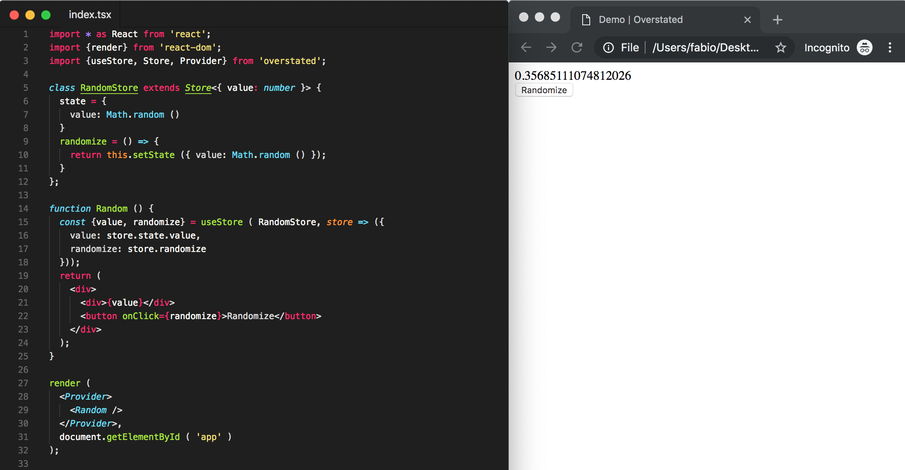
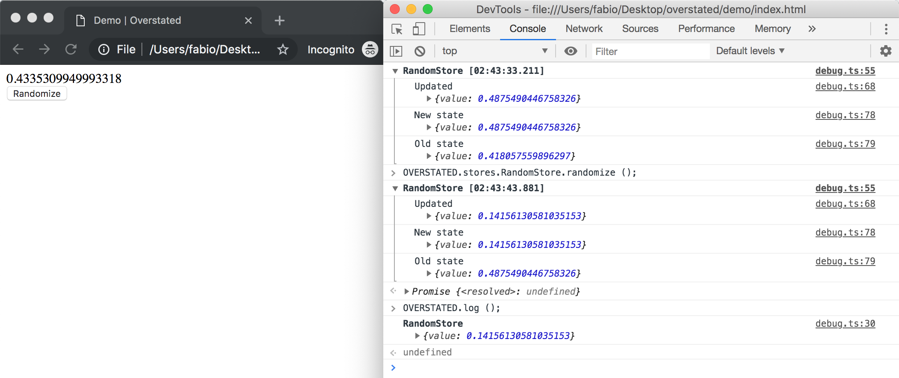

# Overstated

React state management library that's delightful to use, without sacrificing performance or scalability.

[](resources/demo.png)

## Features

- **Easy**: there's barely anything you need to learn before you can start using Overstated, you just have to wrap your app with [`Provider`](#provider), define some initial state and some methods for updating it in a [`Store`](#store) and then access the state and methods you need in your components either via the [`useStore`](#useStore) hook or [`connect`](#connect).
- **Performant**: Overstated has been designed from the ground up with performance in mind, everything you need to write very performant applications (selector function, [`autosuspend`](#autosuspend), [`debug`](#debug)) is built-in.
- **Scalable**: you can write big apps with this. You can [`connect`](#connect) to multiple stores with a single call, [`compose`](#compose) multiple stores easily and use [`middlewares`](#middlewares).
- **TypeScript-ready**: Overstated has been written in TypeScript and enables you to get a _fully typed_ app with minimal effort.

Check out the [FAQ](#faq) section for some commonly asked questions.

## Install

```sh
npm install --save overstated
```

## Usage

- [`Provider`](#provider)
- [`Store`](#store)
  - [`Core methods`](#core-methods)
  - [`Suspension`](#suspension)
  - [`autosuspend`](#autosuspend)
  - [`middlewares`](#middlewares)
- [`useStore`](#usestore)
- [`connect`](#connect)
- [`compose`](#compose)
- [`debug`](#debug)
- [`Hooks`](#hooks)

#### `Provider`

The `Provider` component needs to wrap your app in order for this to work:

```tsx
import * as React from 'react';
import {render} from 'react-dom';
import App from './app';
import {Provider} from 'overstated';

render (
  <Provider>
    <App />
  </Provider>,
  document.getElementById ( 'app' )
);
```

- ℹ️ An error will be thrown if you forget to do this.
- ℹ️ You can inject some stores that will be used instead of the regular ones, even if you are pre-instantiating them, via the `inject` attribute: `<Provider inject={[StoreInstanceFoo, StoreInstanceBar]}>`, this is useful for testing purposes.

#### `Store`

The `Store` is where you define your initial state and the methods for updating it. Then your components will retrieve the state and methods they need via [`useStore`](#usestore) or [`connect`](#connect) and they will be re-rendered when the state changes.

###### Core methods

This is the core interface of a `Store`:

```ts
class Store<State> {
  state: State = {};
  setState ( updater: State | Function, callback?: Function ): Promise<void>;
}
```

It is modeled after a React class component and it works in a similar way:

- There's a `state` object, which:
  - Must be a plain object, other kinds of data (primitives, arrays, functions etc.) aren't supported.
  - You must _never_ mutate directly.
- There's a `setState` method, which:
  - Can accept either a new state object (which will be merged with the current one) or a function, which will be called with the current state as its first argument, which should return a new state object.
  - Can accept a callback function, which will be called once the state has been updated.
  - Returns a promise, which you can `await` if you need to wait until the state has been updated.

You define your stores by extending the default one:

```ts
import {Store} from 'overstated';

class CounterStore extends Store<{value: number}> {
  state = {
    value: 0
  }
  increment = () => {
    return this.setState ( state => ({ value: state.value + 1 }) );
  }
  decrement = () => {
    return this.setState ( state => ({ value: state.value + 1 }) );
  }
}
```

- ℹ️ If you're using TypeScript you should provide the type of the state object.
- ℹ️ _Never_ mutate the state directly (`this.state.foo = 123`), always use `setState` (`this.setState ({ foo: 123 })`).
- ℹ️ Don't read state immediately after setting it, as it won't be updated immediately.
- ℹ️ If the next state depends on the current state you should call `setState` with a function, to make sure that the state is computed properly and you aren't using an older version of the state object.
- ℹ️ You should always define your methods like this: `foo = () => {}` rather than like this: `foo () {}` so that you will never have to call `Function#bind` on them when using them.
- ℹ️ If your method is updating the state you should always `return` the value returned by `setState`, so that other methods can `await` it if needed.
- ℹ️ In general stores are just plain classes, so testing them is easy.

###### Suspension

Overstated's stores have the ability to "suspend" React re-renders that would otherwise occur when their state changes, this is useful when you want to update the state many times but only want to cause one re-render. This is the related interface:

```ts
class Store {
  suspend (): void
  unsuspend ( callback?: Function ): Promise<void>
  isSuspended (): boolean
}
```

- The `suspend` method allows you to suspend re-renders.
- The `unsuspend` method allows you to unsuspend re-renders: if before calling `unsuspend` a re-render has been prevented it will now be triggered.
  - Can accept a callback function, which will be called after any potential re-renders caused by this function.
- The `isSuspended` method allows you to check if re-renders are currenly suspended.

- ℹ️ If for instance you call `suspend` 3 times you should also call `unsuspend` 3 times to resume operating as normal.
- ℹ️ Using this APIs directly can be cumbersome, as you'd probably want to use it in all of your methods that update the state, and you'd have to make sure that `unsuspend` gets properly called even if your methods throw an error, otherwise re-renders will remain suspended forever. Instead you should use [`autosuspend`](#autosuspend), which takes care of everything for you.

###### `autosuspend`

`autosuspend` is a method for automatically and safely [`suspend`](#suspension)-ing React re-renders when a method gets called and unsuspending them right before returning from it. This is useful for ensuring that even if your methods update the state many times they only cause 1 re-render. You might not want this behavior, so it's opt-in:

```ts
import CounterStore from './counter_store';

CounterStore.autosuspend ();
```

The `autosuspend` method accepts an option object with the following shape:

```ts
const options = {
  children: true, // Whether to autosuspend children too
  methods: /^(?!_|(?:(?:get|has|is)(?![a-z0-9])))/, // Methods matching this regex will be autosuspended
  methodsInclude: undefined, // Methods matching this regex will be autosuspended, has higher priority over the "methods" regex
  methodsExclude: undefined, // Methods matching this regex will be autosuspended, has higher priority over the "methods" regex and the "methodsInclude" regex
  propagateUp: false, // Whether to propagate up the suspension to parents
  propagateDown: false // Whether to propagate down the suspension to children
};
```

- `methods` is a regex, if your method's name matches that regex then it will be autosuspended. By default methods starting with `_`, `get`, `has` or `is` won't be autosuspended, as we are assuming that those won't be updating the state.
- `methodsInclude` is a regex, if your method's name matches that regex then it will be autosuspended, has higher proprity over `methods`.
- `methodsExclude` is a regex, if your method's name matches that regex then it will _not_ be autosuspended, has higher proprity over `methods` and `methodsInclude`.
- `propagateUp` checks whether parent stores (read more about them in the [`compose`](#compose) section) should get suspended too, generally you won't need to set this option manually.
- `propagateDown` checks whether children stores (read more about them in the [`compose`](#compose) section) should get suspended too, generally you won't need to set this option manually.
- `children` checks whether children stores (read more about them in the [`compose`](#compose) section) should get autosuspended too, generally you won't need to set this option manually.

- ℹ️ If you try to autosuspend a store twice an error will be thrown.
- ℹ️ When autosuspending a store its children stores (if any) will be autosuspended too, read more about them in the [`compose`](#compose) section.
- ℹ️ You can also set those options in each store's class as the value of their `autosuspendOptions` instance property.
- ℹ️ It's recommended to include or exclude new methods via the `methodsInclude` and `methodsExclude` optional regexes, so that you won't have to manually modify the `methods` regex.
- ℹ️ Since this relies on the individual methods' names you'll have to make sure that your minifier isn't minifing function names.

###### `middlewares`

You can register and unregister middlewares on each store, they will be called _every time_ the store gets updated, including if it was updated from within a middleware, and they will receive the previous state object as their first argument. This is the related interface:

```ts
class Store {
  middlewares: Function[] = []; // Array of currently registered middlewares
  registerMiddleware ( middleware: Function ): void;
  unregisterMiddleware ( middleware: Function ): void;
}
```

- `middlewares` contains all the currently registered middlewares.
- `registerMiddleware` allows you to add a new middleware.
- `unregisterMiddleware` allows you to remove an existing middleware.

You can use middlewares like so:

```ts
import {Store} from 'overstated';

class MyStore extends Store {
  constructor () {
    super ();
    this.registerMiddleware ( this.middlewareLog );
  }
  middlewareLog = ( prevState ) => {
    console.log ( 'prevState:', prevState );
    console.log ( 'state:', this.state );
  }
}
```

- ℹ️ You should use as few middlewares as possible, as they might get called very often.
- ℹ️ Updating the state from within a middleware also causes all middlewares affected by that to be called again, so you should avoid doing so if possible.
- ℹ️ Registering middlewares in parent stores (read more about them in the [`compose`](#compose) section) is discouraged, as they will also get called if a children store's state is updated.
- ℹ️ It's good practice to name your middlewares `middleware*`, as that makes it clear that those are middlewares.

#### `useStore`

`useStore` is a React [hook](https://reactjs.org/docs/hooks-intro.html) for accessing a store's state and methods from within a component. You should always use `useStore`, unless you can't use React hooks, instead of [`connect`](#connect), because it preserves your TypeScript types completely. This is its interface:

```ts
useStore ( storeClassOrInstance, selector: store => R, deps: ReadonlyArray<any> = [] ) R
```

- The first argument can be either a store class or a pre-instantiated store.
- The second argument is a selector (a function) which will receive the _instance_ of the passed store and will return something, whatever will be returned by the selector will also be the return value of the `useStore` call.
- The third argument is an optional array of dependencies. If your selector relies on external dependencies you must include all of them in the `deps` array, like you would when using `useCallback`. By default the array of dependencies will be an empty array, so the first selector function will get reused indefinitely.

You can use it like so:

```tsx
import CounterStore from './counter_store';
import {useStore} from 'overstated';

function Counter () {

  const {value, increment, decrement} = useStore ( CounterStore, store => ({
    value: store.state.value,
    increment: store.increment,
    decrement: store.decrement
  }));

  return (
    <div>
      <div>{value}</div>
      <button onClick={increment}>Increment</button>
      <button onClick={decrement}>Decrement</button>
    </div>
  );

}
```

- ℹ️ Every time the store's state changes Overstated will re-run the selector passed to `useStore` and compare the previously returned value with the current one, if nothing changed we stop there, if something changed the component gets re-rendered.
- ℹ️ If you pass `useStore` a pre-instantiated store then you won't need to retrieve its methods this way, but instead you can access them directly (`CounterStore.increment`), this has a couple of performance advantages:
  - The object returned by the selector will be slightly faster to compare against the previous one.
  - If in a component you don't need to access any state at all from a selector, but only need to access its methods, then you can entirely avoid using `useStore` for that component.
- ℹ️ If you need to access state/methods from multiple stores just call `useStore` multiple times.
- ℹ️ When using [`compose`](#compose) you may encounter the scenario where you need to access some methods from store `A`, but those methods actually access the state of store `B`, so passing store `A` to `useStore` won't properly update the component because the changes in state will happen in store `B`. There are 2 ways to solve this issue:
  1. Pass [`compose`](#compose) a store higher-up in the hierarchy that has both store `A` and store `B` below itself.
  2. Pre-instantiate your stores, pass store `B` to `useStore`, but then reference the pre-instantiated instance of store `A` inside your selector function. This solution, albeit slightly more performant, is discouraged because you'll have to reason about what stores' states your selector is actually accessing, and that's very error prone.

#### `connect`

`connect` is an alternative to [`useStore`](#usestore). You should generally prefer `useStore` over this as `connect` doesn't fully preserve your TypeScript types (yet). This is its interface:

```ts
// USAGE 1
connect ( storeClassOrInstance )( ReactComponent );
// USAGE 2
connect ({
  store?: storeClassOrInstance,
  stores?: storeClassOrInstance,
  selector?: Function
})( ReactComponent );
// USAGE 3
connect ({
  store?: storeClassOrInstance,
  stores?: storeClassOrInstance,
  selector?: Function,
  render?: ReactComponent
});
```

It is a decorator, so you can also call it like `@connect ({ ... })` before a React's class component definition.

It can be used in either of those 3 ways:

1. Pass it a store class or instance, and then pass it a React component.
2. Pass it some options, and then pass it a React component.
3. Pass it some options which include the `render` option, that will be used as the React component.

The options object supports the following options:

- `store`: a store class on instance.
- `stores`: an array of store classes or instances.
- `selector`: a selector which, similarly to how [`useStore`](#usestore)'s selector works, will be called with the following object: `{ store, stores }` and will have to return the props to pass to the component.
- `render`: a component to render. This property exists so that if you wish to you can define your React function component there and have everything neatly contained within a single object and cleanly indented.

#### `compose`

`compose` allows you to set a `parent <-> child` relationship between your stores, so that a parent store has access to its children and the children have access to their parent (and as a consequence to each other too). This is useful because as your app grows you might want to split your app's state and methods into multiple stores that can talk to each other.

```ts
compose ({
  child1: StoreClassOrInstance1,
  child2: StoreClassOrInstance2,
  // ...
})( ParentStore )
```

You can use it like so:

```ts
import {compose, Store} from 'overstated';

class Foo extends Store<{value: number}, App> {
  state: {
    value: 123
  }
  setValue = ( value: number ) => {
    return this.setState ({ value });
  }
  example = () => {
    this.ctx.updateBar (); // Accessing the parent
    this.ctx.bar.setValue ( 'Hi' ); // Accessing a sibling via the parent
  }
}

class Bar extends Store<{value: string}, App> {
  state: {
    value: 'hello'
  }
  setValue = ( value: string ) => {
    return this.setState ({ value });
  }
  example = () => {
    this.ctx.updateFoo (); // Accessing the parent
    this.ctx.foo.setValue ( 0 ); // Accessing a sibling via the parent
  }
}

@compose ({
  foo: Foo,
  bar: Bar
})
class App extends Store<{}, undefined, {foo: Foo, bar: Bar}> {
  updateFoo = () => {
    return this.foo.setValue ( 10 ); // Accessing a sibling
  }
  updateBar = () => {
    return this.bar.setValue ( 'hello there!' ); // Accessing a sibling
  }
}
```

It works like this:

1. Firt of all if you're using TypeScript the Store class accepts a couple more types: the first type, which we already encountered, describes the interface of the state, the second type describes the inferface of the parent store (if any) and the third stype describes the interface of the children stores (if any).
2. `compose` will make sure that all stores classes/instances passed to it are accessible from the parent, so that if you tell `compose` to map the `Foo` store to the `foo` property then you can access it via `this.foo` from the parent store.
3. `compose` will make sure that all child stores can access the parent (and as a consequence each other too) via `this.ctx`.
4. If the stores passed to `compose` aren't already instantiated they will be instantiated right when the parent store itself is instantiated.
5. Finally whenever a child store's state gets updated the parent's state will also be updated: the content of the state will be the same but the state itself will be a different object, this is done in order to ensure that if you connect to a parent store via [`useStore`](#usestore) or [`connect`](#connect) your component will re-render properly also when the children stores get updated. For the same reason your [`middlewares`](#middlewares) registered in a parent store will also get called when the children's stores get updated.

- ℹ️ It's important to note that if you pass a parent store to [`useStore`](#usestore) or [`connect`](#connect) then your component could potentially attempt to re-render even when state from other stores which it doesn't care about gets updated. To avoid this potentially significant performance penalty you should instead, whenever possible, pre-instantiate your parent store and then pass the child store you need directly (`MyParentStore.foo` rather than `MyParentStore`) to [`useStore`](#usestore) or [`connect`](#connect).

#### `debug`

`debug` is a simple way to access your stores and their state from the the devtools and see at a glance when any store's state changes.



This is its interface:

```ts
debug ({
  collapsed: false, // Whether the logged group should be collapsed
  logNewStores: false, // Whether to log when a new store is instantiated
  logStateDiffChanges: true, // Whether to log diffs (added, updated, removed) state changes
  logStateFullChanges: true // Whether to log the previous and current state in their entirity
});
```

You can use it like so:

```ts
import {debug} from 'overstated';

debug ();
```

Once called `debug` also defines a global object named `OVERSTATED`, which you can access from the devtools. This is its interface:

```ts
window.OVERSTATED = {
  stores: { ... }, // Access all stores
  states: { ... }, // Access all states
  log (): void // Log all states
};
```

You can use it like so:

```ts
OVERSTATED.stores.CounterStore.increment (); // If you want to call a method manually
OVERSTATED.states.CounterStore; // If you want to access a store's state quickly
OVERSTATED.log (); // If you want to see all your stores' states at once
```

- ℹ️ It's important to call `debug` before rendering the app and before manually instantiating any stores.

- ℹ️ Make sure to enabled `debug` only during development.

#### `Hooks`

`Hooks` provides a simple way to "hook" into Overstated's internal events. Each hook has the following interface:

```ts
class Hook {
  subscribe ( callback: Function ): void
  unsubscribe ( callback: Function ): void
}
```

- `subscribe` registers a function for being called every time that hook is triggered.
- `unsubscribe` unregisters a previously registered function.

These are all the hooks currently available:

```ts
const Hooks = {
  store: {
    new: Hook // This hook is actually used to implement `debug`
  }
};
```

You can use hooks like so:

```ts
import {Hooks} from 'overstated';

Hooks.store.new.subscribe ( store => console.log ( 'New store just instantiated:', store ) );
```

If you need some other hooks for your Overstated plugin let me know and I'll make sure to add it.

> We currently don't have an official "Overstated DevTools Extension", but it would be super cool to have one. I'm thinking basically one could implement everything implemented by [`debug`](#debug) but in a panel accessible from the browser's devtools. Perhaps some other cool features could be implemented like time travel debugging, for restoring the app to a previous state in time. If somebody would like to implement this please do let me know! 😃

## FAQ

#### Why not using [Unstated](https://github.com/jamiebuilds/unstated)?

As you might have noticed Overstated is modeled after [Unstated](https://github.com/jamiebuilds/unstated), which I've been using in the past few months and mostly liking. But Unstated has a few problems:

- Subscribing to a store is cumbersone, our [`useStore`](#usestore) is **so** much nicer, especially if you're using TypeScript.
- It's impossible to centralize stores like we can do with [`compose`](#compose), so except for the smallest apps you have to subscribe to multiple stores or deal with a massive single-file store.
- There's no concept of [`suspension`](#suspension), so if you update the state within a loop enough times the app could basically crash because too many re-renders are triggered.
- There's no way to define [`middlewares`](#middlewares), and sometimes you want them.
- There's no [`debug`](#debug)-like capabilities built-in.
- There's no concept of a "selector" function, so your components always re-render even if they don't care about the particular bit of state that changed.

Some of these problems can be solved via third-party libraries, which me and others have written and are available [here](https://github.com/tiaanduplessis/awesome-unstated), but some things just can't be implemented in a performant manner when you're building on top of Unstated, for instance I ended up adding 5+ Higher-order-Components to each of my components that needed to subscribe to a store. And by implementing all this in the core you can do some nice things like skipping re-renders much earlier in the process.

In the end I decided that basically rewriting Unstated, but with performance in mind, more features and better TypeScript types, was the right option for me.

I don't think there's _any_ reason to use Unstated over Overstated frankly. You can't even open an issue in Unstated's repository because the issues page is disabled.

#### Why not using [Redux](https://redux.js.org/)?

I'm not as familiar with [Redux](https://redux.js.org/) as I am with [Unstated](https://github.com/jamiebuilds/unstated), but I think some reasons for using Overstated over Redux might be:

- If you don't know or like Redux already I think Overstated will be much easier to learn and use as we don't have "actions", "reducers", there's no big switch statement to write, nothing to "dispatch", no "payloads", nothing weird that needs to be done for asynchronous actions, no need to write TypeScript types for actions, we _just call some methods and pass them arguments_, just like you would normally do.
- I'm not sure how Redux handles actions dispatched from within actions, via [`suspension`](#suspension) and [`autosuspend`](#autosuspend) we can make sure that that causes a single re-render of your app, maybe you can do the same with Redux too? Maybe you're not supposed to do that? I don't know.

But Redux is definitely a fine library, which has been battle-tested and which has an amazing ecosystem around it.

I guess ultimatelly the reason to pick one over the other might be a matter of personal preference.

#### How to write a _very_ performant app?

In order to write a _very_ performant app there's only one golden rule:

1. Make sure that your components are only re-rendered when necessary, and make sure that each render is fast.

To break that down into smaller to digest tips, roughly ordered by importance:

- Mesure, measure and measure. Make you sure you know what the slowest parts of your apps actually are before attempting any optimizations.
- Always use a selector function.
- Make sure your selectors are fast.
- Use [`autosuspend`](#autosuspend) to make sure that 1 method call causes 1 re-render. You may not always want this, but in general I think it's a good starting point.
- Write smaller stores that contain less state, so that they each of them will trigger fewer re-renders.
- If you're using [`compose`](#compose), pre-instantiate your parent store and pass the child store directly to [`useStore`](#usestore) or [`connect`](#connect), so that your component won't attempt to re-render if other stores' states change.
- Use as few middlewares as possible, there's probably another way to implement the same thing which doesn't involves middlewares at all.
- Make sure your middlewares are fast.
- Pre-instantiate your stores and use their methods directly rather than retrieving them via [`useStore`](#usestore) or [`connect`](#connect).
- Always define your methods like this: `foo = () => {}` rather than like this: `foo () {}` so that you will never have to call `Function#bind` on them when using them.

And in general make sure to also follow JavaScript/React's best practices with regards to performance.

## Thanks

- [@webstrand](https://github.com/webstrand): for providing the trickiest TypeScript annotations we needed.
- [@jamiebuilds](https://github.com/jamiebuilds): for writing [Unstated](https://github.com/jamiebuilds/unstated), the first state management library that really resonated with me.
- The [@facebook/react](https://github.com/facebook/react) team: for developing React and hooks, which are wonderful.
- [My mom](https://itty.bitty.site/#/?XQAAAAK4AAAAAAAAAAApm8pYeRYCgyZ/d/N1umPBxXSM6VsH3cInyLQkaT8C8ZZPUkK3BN0yB9VTOwZ8gFKN48blsGdQVFUtCDDDZbXaDai+S9zRMow+KDwMO14u8nNm2DPxT9OGt+LASHSOjJn+3sskZTVHvV14hbBO7v7zcfkA) too, since this thanks section is getting akwardly long anyway.

## License

MIT © Fabio Spampinato
